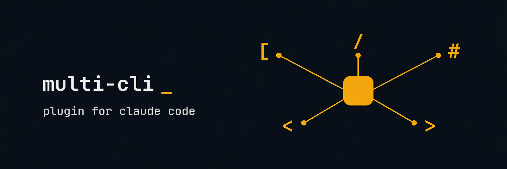

# cc-multi-cli-plugin

[](LICENSE)
[](https://github.com/greenpolo/cc-multi-cli-plugin/releases)
[](https://docs.anthropic.com/en/docs/claude-code)
[](#commands)
[](https://github.com/greenpolo/cc-multi-cli-plugin/stargazers)

If you have access to multiple AI coding CLIs (Codex, Gemini, Cursor, Copilot, etc.), this plugin lets Claude Code delegate to whichever one is best for the task — without you having to switch tools or run them yourself.

Each CLI is wired up through its native protocol (ACP, ASP, JSON-RPC). This allows you to pick and choose all the best features from each CLIs; like /debug mode from Cursor, /research from Copilot, etc... Sessions, streaming, tool calls, and background jobs all work normally.

## Install

Paste into Claude Code:

```
/plugin marketplace add https://github.com/greenpolo/cc-multi-cli-plugin
/plugin install multi@cc-multi-cli-plugin
/multi:setup
```

`/multi:setup` detects which CLIs you have, installs the matching sub-plugins, and wires Exa + Context7 MCPs into each.

## Skills Included:

Two skills ship with the plugin:

- **multi-cli-anything** — adds ANY CLI (Qwen, Aider, OpenCode, anything that speaks ACP) as a subagent that Claude can invoke at will. Claude scaffolds the new plugin in the marketplace.

- **customize** — change which CLI handles what. *"Make Gemini the writer instead of Cursor."* Claude does the file edits, reinstalls, and tells you what restarts are needed.

Just ask Claude in plain English. The skills activate automatically.

## Commands 

| | |
|---|---|
| `/gemini:research` | Deep research with Gemini's 1M-token context |
| `/gemini:explore` | Fast codebase exploration (Gemini 3 Flash) |
| `/codex:execute` | Hand a plan step to Codex |
| `/cursor:write` | Bulk code writing |
| `/cursor:plan` | Design an approach before coding |
| `/cursor:debug` | Hypothesis-driven debugging |
| `/copilot:research` | GitHub + web investigation |
| `/copilot:review` | GitHub-context code review |
| `/copilot:plan` | Copilot's plan mode |

Claude can also auto-dispatch to these without you typing the command.

All of them are interchangeable, and can be altered to whatever you want using the  /customize skill. 

## Known issues

These are upstream CLI bugs the plugin can't fully fix, but works around where possible. If you hit something not listed, set `ACP_TRACE=1` and check stderr — that reveals which JSON-RPC traffic is or isn't crossing the wire.

- **Cursor `agent acp` 2026.04.17 — Terminal/MCP regression.** The `Terminal` (execute) tool can stick at `in_progress` forever, and MCP tools silently fail. Cursor staff has acknowledged it. The plugin auto-injects a permissive allowlist into `~/.cursor/cli-config.json` which keeps simple shell exec working; complex multi-tool runs may still hang. To pin an older Cursor build: `export CURSOR_AGENT_PATH=<path-to-old-build>`. ([forum](https://forum.cursor.com/t/cursor-agent-cli-mcp-tool-calls-silently-stopped-working-in-2026-04-17/158988))

- **Cursor `agent acp` — `mcpServers` ignored.** MCP servers passed via ACP `session/new` are silently dropped in `agent acp` mode (per Cursor staff). The plugin still wires them — they're consumed correctly by Gemini, Copilot, and Qwen — and falls back to Cursor's own `~/.cursor/mcp.json` for Cursor. ([forum](https://forum.cursor.com/t/mcp-servers-passed-via-session-new-dont-work-in-acp-mode/153823))

- **Cursor `agent acp` — `session/request_permission` not sent.** Cursor's permission gate runs out-of-band against `cli-config.json` instead of the ACP-standard request flow. The plugin handles both paths (auto-approve and allowlist injection). ([forum](https://forum.cursor.com/t/acp-permission-rejection-not-reported-to-client/153825))

When upstream CLIs fix any of the above, the plugin needs no changes — the workarounds become benign.

## License

Apache 2.0. See [NOTICE](NOTICE) for upstream credits.
